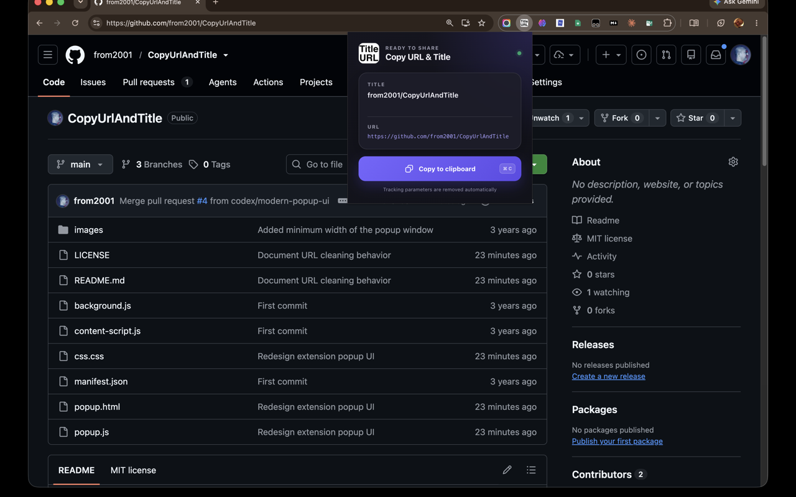

# Copy Clean URL And Title

A Chrome extension that copies the current page's title and URL to the clipboard with automatic cleaning and sanitization.



## Features

- **One-click copy** -- Copies the page title and cleaned URL to the clipboard in `title\nurl` format
- **Tracking parameter removal** -- Strips `fbclid`, `utm_*` parameters, and URL hash fragments
- **Amazon URL normalization** -- Converts various Amazon product URL formats into a canonical `/dp/ASIN` form
- **Title sanitization** -- Normalizes Unicode (NFC), removes control characters, and replaces filesystem-unsafe characters (`:`, `[`, `]`, `|`) with full-width equivalents
- **Clipboard fallback** -- Uses the modern Clipboard API when available, with a `document.execCommand("copy")` fallback for older environments

## Installation

### Install from the Chrome Web Store (Recommended)

1. Open [Copy Clean URL And Title in the Chrome Web Store](https://chromewebstore.google.com/detail/copy-clean-url-and-title/ffalcgkhcnaggflhbegaonflfnomgbjh)
2. Click **Add to Chrome**

### Install Manually from GitHub

1. [Download this repository](https://github.com/from2001/CopyUrlAndTitle/archive/refs/heads/main.zip) as a ZIP file, or clone it with Git
2. If you downloaded the ZIP file, extract it
3. Open `chrome://extensions/` in Chrome
4. Enable **Developer mode**
5. Click **Load unpacked** and select the extracted or cloned project directory

## Usage

1. Navigate to any webpage
2. Click the extension icon in the toolbar
3. The popup displays the sanitized title and processed URL
4. When the URL has been changed, a **Cleaned** badge appears next to the URL label
5. Click **Copy to Clipboard** to copy them

## URL Cleaning

Before copying, the extension processes the current page URL as follows:

- Removes tracking parameters named `fbclid` or beginning with `utm_`, while preserving unrelated query parameters
- Removes URL hash fragments such as `#section`
- Converts recognized Amazon product links to the canonical `https://<amazon-domain>/dp/<ASIN>` format

For example:

```text
https://example.com/article?id=42&utm_source=newsletter#comments
```

becomes:

```text
https://example.com/article?id=42
```

The **Cleaned** badge is shown only when the processed URL differs from the original URL.

## Permissions

- `activeTab` -- Access to the current tab's URL and title only when the extension is activated

## License

[MIT](LICENSE) -- Copyright (c) 2026 Masahiro Yamaguchi
